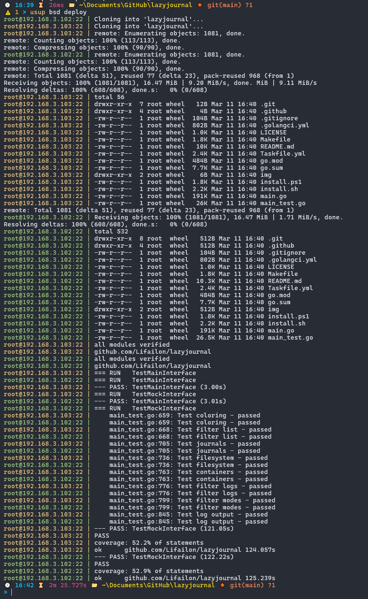

<h2 align="center">
    Update Stack Up
</h2>

A very simple deployment tool that runs a given set of `bash` commands on multiple hosts in parallel. It reads `yaml` configuration, which defines networks (groups of hosts), global variables (which can be changed via arguments), command(s) and targets (groups of commands).

The goal is to revive the [sup](https://github.com/pressly/sup) project, which has not been supported since 2018. First of all, to solve common problems (for example, an error when connecting via `ssh`), expand the functionality (for example, add reading the configuration from the `url`), add support for the Windows system and implement a simple user interface (example for [Jenkins](#jenkins)).

## Install

Run the command in the console to quickly install or update the stable version for Linux or macOS system:

```shell
curl -sS https://raw.githubusercontent.com/Lifailon/usup/main/install.sh | bash
```

To install on Windows, download the binary file from the [releases](https://github.com/Lifailon/usup/releases) page.

## Usage

```bash
usup [options] network <command(s)/target>

usup dev date
usup -u https://raw.githubusercontent.com/Lifailon/usup/refs/heads/main/usupfile.yml dev date
```

This is a simple example that clones a repository and runs tests on two specified machines, which I use to test the [lazyjournal](https://github.com/Lifailon/lazyjournal) project on BSD-based systems:



## Templates and contributing

This repository will also contain a set of [templates](/templates/) for configuring the system and installing packages.

I use the [ubuntu-preparation](/templates/ubuntu-preparation.yml) template for initial configuration of new hosts and [fetch](/templates/fetch.yml) to collect system information.

You can contribute and add your template to this repository via [Pull Request](https://github.com/Lifailon/usup/pulls).

## Supported file names

By default, the following configuration file names will be searched for on startup, in order of priority.

```
usupfile.yml
usupfile.yaml
Usupfile.yml
Usupfile.yaml
supfile.yml
supfile.yaml
Supfile.yml
Supfile.yaml
```

## Options

List of available flags.

| Option                                  | Description                         |
| -                                       | -                                   |
| `-f usupfile.yml`                       | Custom path to file configuration   |
| `-u https://example.com/usupfile.yml`   | Url path to file configuration      |
| `-e`, `--env=[]`                        | Set environment variables           |
| `--only REGEXP`                         | Filter hosts matching regexp        |
| `--except REGEXP`                       | Filter out hosts matching regexp    |
| `-D`, `--debug`                         | Enable debug/verbose mode           |
| `--disable-prefix`                      | Disable hostname prefix             |
| `-h`, `--help`                          | Show help/usage                     |
| `-v`, `--version`                       | Print version                       |

## Network

Network is a group of hosts that can be static or dynamic from URL or a local file.

```yaml
networks:
  local:
    hosts:
      - localhost
  dev:
    hosts:
      - lifailon@192.168.3.101:2121
      - lifailon@192.168.3.104:2121
  remote-host-list:
    # Read host list from URL in Linux
    inventory: printf '%s\n' $(curl -s https://raw.githubusercontent.com/Lifailon/usup/refs/heads/main/hostlist)
    # Windows PowerShell or PowerShell Core
    # inventory: Invoke-RestMethod https://raw.githubusercontent.com/Lifailon/usup/refs/heads/main/hostlist
  local-host-list:
    # Linux
    inventory: printf '%s\n' $(cat ./hostlist)
    # Windows
    # inventory: Get-Content ./hostlist
```

## Variables and Command

```yaml
env:
  FILE_NAME: test
  FILE_FORMAT: txt

networks:
  dev:
    hosts:
      - lifailon@192.168.3.101:2121
      - lifailon@192.168.3.104:2121

commands:
  echo:
    desc: Print filename from env vars
    run: echo $FILE_NAME.$FILE_FORMAT
```

Output the contents of variables:

```bash
usup dev echo
lifailon@192.168.3.101:2121 | test.txt
lifailon@192.168.3.104:2121 | test.txt
```

Change the contents of variables:

```bash
usup -e "FILE_NAME=new_test" -e "FILE_FORMAT=temp" dev echo
lifailon@192.168.3.104:2121 | new_test.temp
lifailon@192.168.3.101:2121 | new_test.temp
```

Default environment variables available:

| Variable Name     | Description                                           |
| -                 | -                                                     |
| `$SUP_HOST`       | Current host                                          |
| `$SUP_NETWORK`    | Current network                                       |
| `$SUP_USER`       | User who invoked command                              |
| `$SUP_TIME`       | Date/time of command invocation                       |
| `$SUP_ENV`        | Environment variables provided on command invocation  |

## Serial and once command

`serial: N` constraints a command to be run on `N` hosts at a time at maximum.

```yaml
commands:
  echo:
    desc: Print filename from env vars
    run: echo $FILE_NAME.$FILE_FORMAT
    serial: 2
```

`once: true` constraints a command to be run only on one host.

```yaml
commands:
  file:
    desc: Creat new test file
    run: echo "This is test" > ./$FILE_NAME.$FILE_FORMAT
    once: true
```

`usup dev echo file`

## Upload files

Uploads files/directories to all remote hosts (uses `tar` under the hood).

```yaml
commands:
  upload:
    desc: Upload dist files to all hosts
    upload:
      - src: ./$FILE_NAME.$FILE_FORMAT
        dst: /tmp/
```

## Local command

Runs command always on localhost.

```yaml
commands:
    build:
        desc: Build in Windows
        local: go build -o ./bin/sup.exe ./cmd/sup
```

## Interactive Bash

You can pass any `bash` commands from `stdin` to execute them on all hosts:

```yaml
commands:
  bash:
    desc: Interactive Bash on all hosts
    stdin: true
    run: bash
```

Send commands to all hosts simultaneously for execution.

```bash
echo 'sudo apt-get update -y && sudo apt-get upgrade -y' | usup production bash
# or
usup dev bash
ls
exit
```

## Target

Target is an alias for a set of commands. Each command will be run on all hosts in parallel, will check the return status from all hosts and continue running subsequent commands only if successful (any error on any host will abort the process).

```yaml
targets:
  get:
    - uptime
    - date
  up:
    - upload
    - cat
```

`usup dev get` get uptime and current time in the system from all hosts simultaneously (run `uptime` and `date` commands).

`usup dev up` download and read the file.

## Jenkins

You can use the Jenkins generic pipeline, which uploads a list of all available configuration files (in `yaml/yml` format) to a specified GitHub repository, to select the file you want and define all the parameters available in it to run. A list of networks, commands and targets to choose from is available, as well as a list of available variables and their values, which can be overridden.

To import it, you need to fill in the active parameters from the [param](jenkins/params.groovy) file and load [Pipeline](jenkins/pipeline.groovy), or import the [config.xml](jenkins/config.xml) into the `jenkins_home/jobs/<New_Job_Name>` directory and reload the configurations from disk in the interface.

To work, you need to install the [Active Choices](https://plugins.jenkins.io/uno-choice) plugin and add a private ssh key to the slave agents (installation and removal of usup is done in pipeline stages).


## License

Licensed under the [MIT License](./LICENSE).
